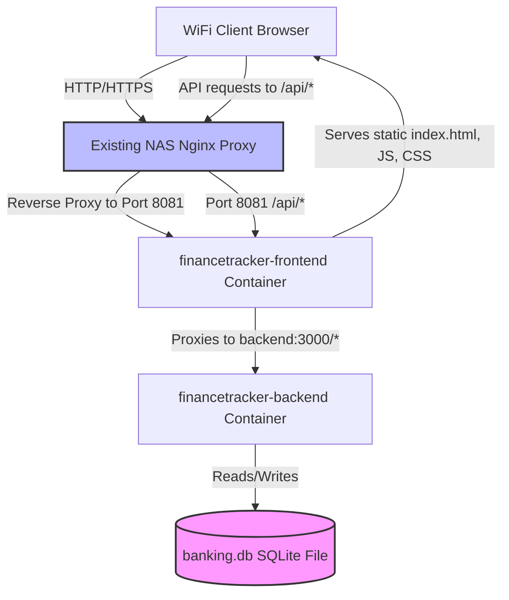

# Finance Tracker Docker Container Build & Deployment Guide

This document describes how to build, export, and deploy the Finance Tracker application (Vite React frontend + NestJS SQLite backend) as a multi-container Docker Compose application on a Ugreen DXP4800 Pro NAS (on NVMe Volume2).

---

## 1. Docker Architecture & Implementation

The application uses a standard **dual-container Docker Compose architecture**:

1. **`financetracker-frontend` (Nginx):** 
   - Serves the compiled static React assets (HTML, CSS, JS).
   - Exposes port `8081` to the local WiFi network.
   - Intercepts requests to `/api/*` and proxies them to the backend API container, stripping the `/api` prefix (matching the local dev proxy environment).
2. **`financetracker-backend` (NestJS):**
   - Runs the NestJS backend API on port `3000` (internal to the Docker bridge network).
   - Mounts the database directory to `/volume2/financetracker/app-data` on the host to persist the SQLite database (`banking.db`).
   - Runs a startup entrypoint that automatically bootstraps the database schema from `schema.sql` if the database does not exist.

### Architecture Data Flow



---

## 2. Directory Structure on NAS (Volume2)

We will set up the application to run under `/volume2/financetracker/` with the following structure:

```text
/volume2/financetracker/
├── docker/                  # Contains all Dockerfiles, configurations, and scripts
│   ├── Dockerfile           # Backend Dockerfile
│   ├── Dockerfile.frontend  # Frontend Dockerfile
│   ├── nginx.conf           # App server Nginx configuration
│   ├── docker-entrypoint.sh # Backend startup/bootstrap script
│   └── docker-compose.yml   # Docker Compose orchestration
├── app-data/                # Persistent database directory
│   └── banking.db           # SQLite database (auto-created on first start)
└── src-code/                # Optional: Project source code (if building on the NAS)
```

---

## 3. Deployment Configuration Files

All configuration files are located under the `./docker/` directory:

- **[./.dockerignore](./.dockerignore):** Excludes node_modules, local sqlite database files, and build assets from Docker builds.
- **[./docker/Dockerfile](./docker/Dockerfile):** Multi-stage build that compiles NestJS backend files and builds dependencies. Pins both stages to Bookworm releases to prevent GLIBC version mismatches and compiles native dependencies from source.
- **[./docker/docker-entrypoint.sh](./docker/docker-entrypoint.sh):** Startup shell script for the backend container that automatically bootstraps the database schema from `schema.sql` if the database file is not found.
- **[./docker/Dockerfile.frontend](./docker/Dockerfile.frontend):** Multi-stage build that compiles the React app using Vite and packages the static assets into Nginx. Bypasses strict TS checks to prevent unused variable flags from halting builds.
- **[./docker/nginx.conf](./docker/nginx.conf):** Nginx web server configuration that serves the static frontend assets and routes `/api` requests to the NestJS backend container. Configured with a dynamic resolver and rewrite rule to prevent startup crashes.
- **[./docker/docker-compose.yml](./docker/docker-compose.yml):** Coordinates the containers, exposes port `8081` for the WiFi network, and maps persistent storage to `/volume2/financetracker/app-data`.

---

## 4. Build and Deployment Workflows (Workflow B)

Follow these steps to build the images on your development machine, export them, and deploy them on your NAS:

### Step 1: Rebuild the Images Locally
Open a terminal in the project root directory on your local machine and run:
```bash
# Build the backend image (without cache to ensure native C modules compile clean)
docker build --no-cache -t financetracker-backend:latest -f docker/Dockerfile .

# Build the frontend image
docker build -t financetracker-frontend:latest -f docker/Dockerfile.frontend .
```

### Step 2: Export the Images to Tarballs
Export the built images to tar archives:
```bash
docker save -o backend.tar financetracker-backend:latest
docker save -o frontend.tar financetracker-frontend:latest
```

### Step 3: Set up NAS Directory Structure & Transfer Files
1. On your Ugreen DXP4800 Pro NAS, navigate to `Volume2` and create the folders:
   - `/volume2/financetracker/docker/`
   - `/volume2/financetracker/app-data/`
2. Copy the following files to the `/volume2/financetracker/docker/` directory on your NAS:
   - `backend.tar` (generated in Step 2)
   - `frontend.tar` (generated in Step 2)
   - Create a new `docker-compose.yml` file in `/volume2/financetracker/docker/` containing the pre-built configuration:

```yaml
services:
  backend:
    image: financetracker-backend:latest
    container_name: financetracker-backend
    restart: unless-stopped
    volumes:
      - /volume2/financetracker/app-data:/app/db
    environment:
      - NODE_ENV=production
    expose:
      - "3000"

  frontend:
    image: financetracker-frontend:latest
    container_name: financetracker-frontend
    restart: unless-stopped
    ports:
      - "8081:80"
    depends_on:
      - backend
```

> [!IMPORTANT]
> **Volume Mounting Warning:**
> When configuring the containers (whether manually or via Compose), **do NOT mount the source code folder** (e.g. `src-code/` or the project root directory) to `/app` inside the container. 
> 
> The Docker image is fully self-contained and already contains all the compiled backend code and compatible `node_modules` under `/app`. Overwriting `/app` with a host volume mount will bring back the GLIBC 2.38 dependency from your local PC.
> 
> The **only** volume mapping needed is for the database folder:
> - **Host Path:** `/volume2/financetracker/app-data`
> - **Container Path:** `/app/db`

### Step 4: Reload the Images on the NAS (via SSH)
Enable SSH on your Ugreen NAS (under UGOS Settings > Services > Terminal/SSH).
SSH into your NAS, navigate to the docker folder, stop existing containers, and load the new images (using `sudo` for root privileges):
```bash
cd /volume2/financetracker/docker

# Stop existing containers if running
sudo docker compose down

# Load the new backend and frontend images
sudo docker load -i backend.tar
sudo docker load -i frontend.tar
```

### Step 5: Start the Containers on the NAS
Run the following command to start the containers:
```bash
sudo docker compose up -d
```
*(Alternatively, you can create a new project in the UGOS Docker UI, paste the docker-compose YAML above, map the folders, and start it.)*

### Step 6: Update Your Existing NAS Reverse Proxy
Add a proxy rule in your central Nginx reverse proxy to route your desired local domain or subfolder to the application:
- **Proxy Destination IP:** Your NAS Local IP Address
- **Proxy Destination Port:** `8081`
- **Example configuration snippet:**
  ```nginx
  server {
      server_name financetracker.local;

      location / {
          proxy_pass http://localhost:8081;
          proxy_set_header Host $host;
          proxy_set_header X-Real-IP $remote_addr;
          proxy_set_header X-Forwarded-For $proxy_add_x_forwarded_for;
          proxy_set_header X-Forwarded-Proto $scheme;
      }
  }
  ```

---

## 5. Troubleshooting Reference

### A. Backend GLIBC Mismatch Error (`version GLIBC_2.38 not found`)
* **Problem:** The backend native sqlite modules crash on startup stating GLIBC 2.38 is missing.
* **Reason:** This happens because `node:20` resolved to a base image with a newer GLIBC, whereas the runtime `node:20-slim` container resolved to an older cached base image with GLIBC 2.36.
* **Fix:** The `docker/Dockerfile` now explicitly pins the builder and runner to Debian Bookworm (`node:20-bookworm` and `node:20-bookworm-slim`) and forces compilation from source with `npm ci --build-from-source` (ensuring it is compiled against the native GLIBC 2.36 of the container).

### B. Frontend Nginx Crash (`host not found in upstream`)
* **Problem:** Nginx crashes immediately on start saying `host not found in upstream "backend"`.
* **Reason:** Nginx validates all endpoints on startup. If the backend is not yet online or registered on the Docker network, Nginx fails to resolve it and halts.
* **Fix:** `docker/nginx.conf` has been updated to use a dynamic variable and rewrite rule:
  ```nginx
  resolver 127.0.0.11 valid=30s;
  set $backend_host "backend";
  rewrite ^/api/(.*)$ /$1 break;
  proxy_pass http://$backend_host:3000;
  ```
  This allows Nginx to start up instantly, and resolve the backend container name only when a request is made.
